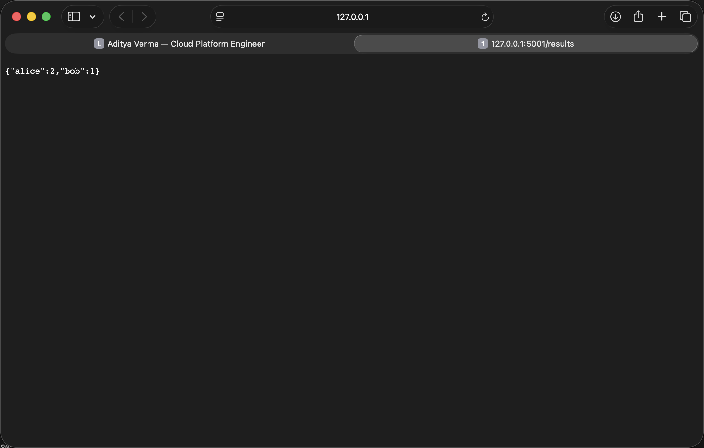
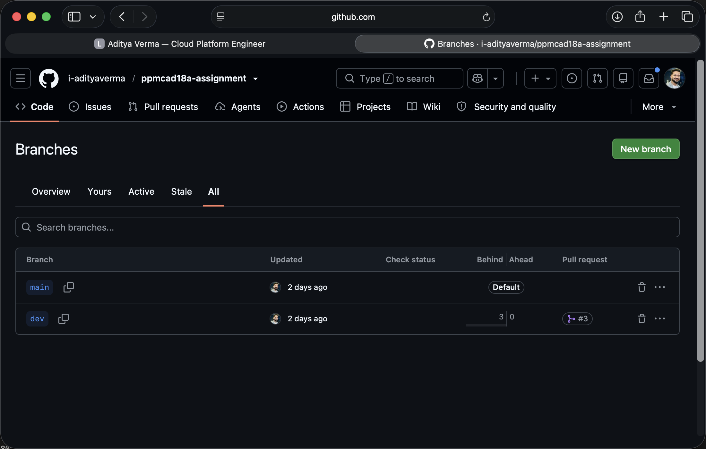
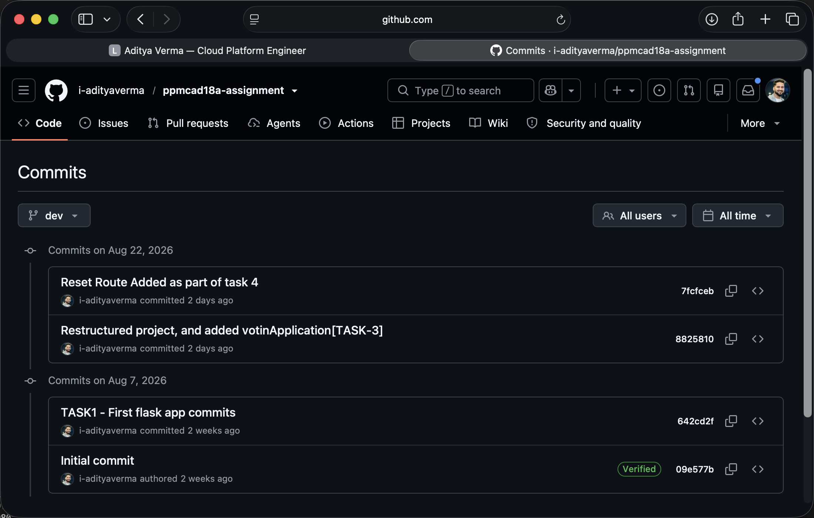

# In-Memory Voting Application

This project is a small voting application that lets people vote for a candidate by visiting a URL. It keeps a running count of every candidate's votes and displays the current results. All votes can also be cleared when a new voting round needs to begin. The information is stored temporarily and is cleared whenever the application is restarted.

## Installation and setup

### Requirements

- Python 3.9 or newer
- Git

### Run the application

Open a terminal and enter the following commands in order:

```bash
git clone https://github.com/i-adityaverma/ppmcad18a-assignment.git
cd ppmcad18a-assignment
python3 -m venv .venv
source .venv/bin/activate
python3 -m pip install Flask
flask --app votingApplication/src/votingApp.py run --port 5001
```

The application will be available at <http://127.0.0.1:5001>. Port `5001` is used because macOS may reserve port `5000` for AirPlay Receiver. On Windows PowerShell, activate the virtual environment with `.venv\Scripts\Activate.ps1` instead.

Stop the application by pressing `Ctrl+C` in the terminal. The votes are held in memory, so stopping or restarting the application clears them.

## API endpoint reference

All endpoints use the `GET` method so they can be tested directly in a browser, as required by the assignment.

| Endpoint | Method | Description | Example response |
| --- | --- | --- | --- |
| `/` | GET | Displays the application welcome message. | `Welcome to the App!` |
| `/health` | GET | Confirms that the application is running. | `App is running` |
| `/vote/<name>` | GET | Records one vote for the supplied candidate. Candidate names are stored in lowercase. | `{"msg":"Vote recorded for alice","votes":1}` |
| `/results` | GET | Returns the current vote count for every candidate as JSON. | `{"alice":2,"bob":1}` |
| `/reset` | GET | Clears all stored vote counts. | `{"msg":"Reset Done"}` |

### Example usage

With the application running, visit these URLs in order:

1. <http://127.0.0.1:5001/vote/alice>
2. <http://127.0.0.1:5001/vote/alice>
3. <http://127.0.0.1:5001/vote/bob>
4. <http://127.0.0.1:5001/results>

The results will contain two votes for Alice and one for Bob. Visit <http://127.0.0.1:5001/reset> and then open `/results` again to confirm that the result is an empty JSON object (`{}`).

## Git workflow

Development is performed on the `dev` branch so unfinished changes do not affect the stable application on `main`. Each feature is implemented and tested on `dev`, then committed with a descriptive message and pushed to GitHub. After the version is working, `dev` is merged into `main` and `main` is pushed to GitHub.

```text
dev:   develop feature -> test -> commit -> push
                                      |
                                      v
main:                         merge stable version -> push
```

This process is repeated for each release so `main` contains only tested versions while `dev` records the development work.

## Version history

| Version | Features |
| --- | --- |
| Version 1 | Basic Flask application with the `/` welcome endpoint and `/health` status endpoint. |
| Version 2 | In-memory voting with `/vote/<name>` and `/results`, followed by the `/reset` enhancement for clearing all votes. |

## Screenshots

### Working application endpoint

The application running locally and displaying the voting results:



### GitHub branches

The GitHub repository showing the `dev` and `main` branches:



### Commit and merge history

The repository history showing the Version 1 and Version 2 development and releases:


